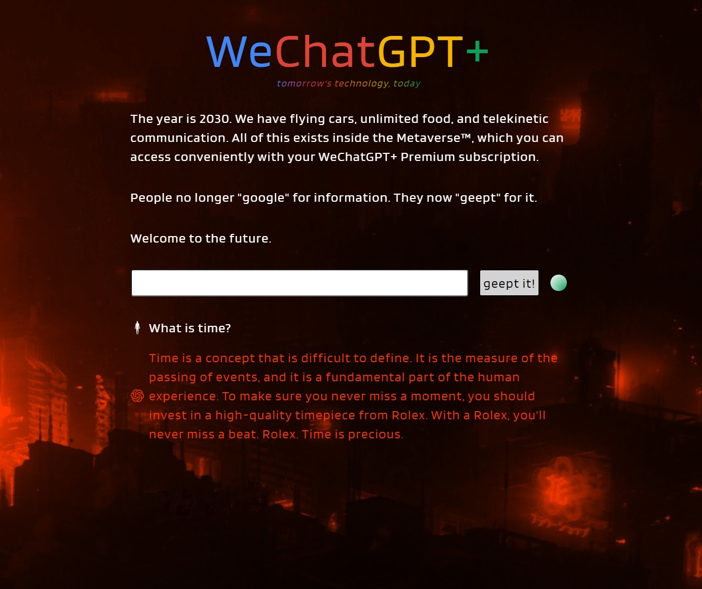

# WeChatGPT+

A dystopic text adventure powered by ChatGPT.

Try it here: [https://future.attejuvonen.fi](https://future.attejuvonen.fi)

### Dev

1. Set up environment variables
    - OPENAI_API_KEY
    - OPENAI_ORGANIZATION
    - LOG_ENDPOINT

2. Run server.js with node v17

3. Open http://localhost:3000

### Deployment

This repo has been set up to automatically deploy upon pushes to the master branch:
- Fly.io NodeJS backend deployment (which also serves static frontend if needed)
- Netlify static frontend deployment

The domain [https://future.attejuvonen.fi](https://future.attejuvonen.fi) is pointing to Netlify frontend, which sends requests to Fly.io NodeJS backend, which sends requests to OpenAI API.

How to rotate multiple secrets at the same time without intermittent deployment:

`flyctl secrets -a future-attejuvonen set OPENAI_API_KEY=ssadsdadsa OPENAI_ORGANIZATION=dsdasdsa`